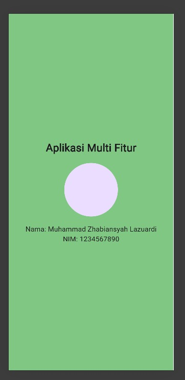
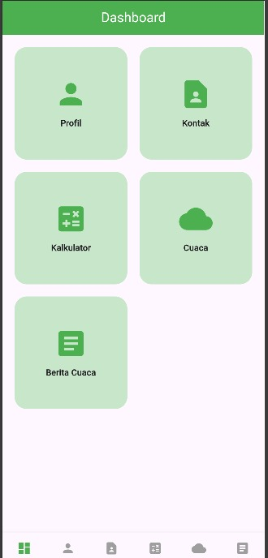
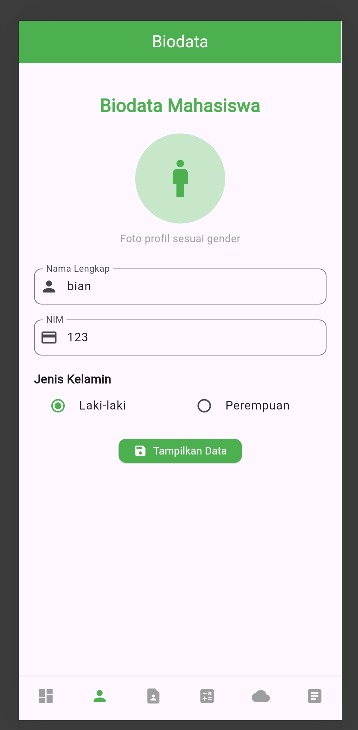
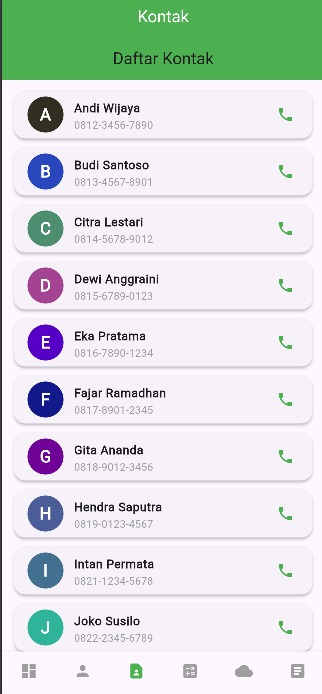
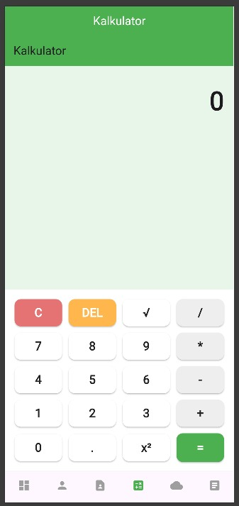
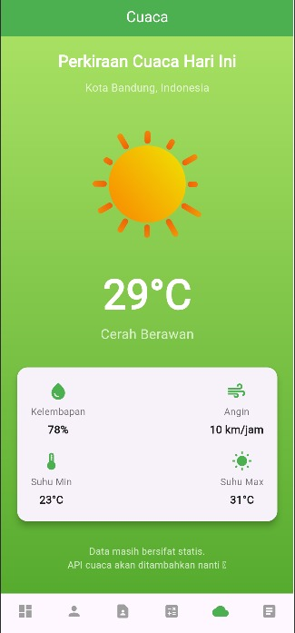

UTS Mobile Application – Flutter

Aplikasi ini merupakan proyek UTS Mobile Programming yang dibangun menggunakan Flutter dan ditujukan untuk menampilkan berbagai fitur dasar aplikasi mobile modern. Aplikasi ini memiliki desain yang sederhana, mudah dipahami, dan menampilkan beberapa halaman fungsional seperti Splash Screen, Dashboard, Profil, Kontak, Kalkulator, Perkiraan Cuaca, dan Berita. terkini

🚀 Fitur Utama
⭐ 1. Splash Screen

Halaman awal yang muncul saat aplikasi dijalankan.
Tujuannya adalah menampilkan logo atau identitas aplikasi dengan animasi ringan sebelum masuk ke aplikasi utama.

Contoh tampilan:

🏠 2. Dashboard

Dashboard berisi navigasi utama menuju seluruh fitur aplikasi.
Di halaman ini pengguna dapat memilih menu seperti Profil, Kontak, Kalkulator, Cuaca, atau Berita.

👤 3. Halaman Profil

Menampilkan informasi identitas pengguna atau pembuat aplikasi, seperti:

Nama,NIM,Foto Profil,Informasi tambahan lain

☎️ 4. Halaman Kontak

Halaman yang memuat informasi kontak penting seperti:

Nama

Nomor Hp

Tampilan dibuat ringkas sehingga mudah diakses oleh pengguna.

🔢 5. Kalkulator Sederhana

Fitur kalkulator yang dapat melakukan operasi dasar seperti:

Penjumlahan

Pengurangan

Perkalian

Pembagian

Kalkulator dibuat menggunakan widget Flutter dan mendukung input interaktif.

🌤️ 6. Perkiraan Cuaca

Halaman ini menampilkan informasi cuaca berdasarkan kondisi saat ini.
Menggunakan icon animasi (atau Lottie JSON) untuk:

Cerah

Hujan

Berawan

Pengguna bisa melihat temperatur, kelembapan, serta kondisi cuaca visual yang menarik.

📰 7. Halaman Berita

Menampilkan daftar berita terbaru dengan layout card/list.
Setiap item berita memiliki:

Judul

Gambar

Deskripsi singkat

Tombol untuk membaca lebih lanjut

Cocok untuk menampilkan berita statis atau data dummy sebagai contoh.

